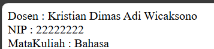

# PWEB2
### OOP (Object Oriented Programming)
*__OOP__* sendiri berisi sebuah data dan fungsi dibungkus ke dalam objek yang dibuat berdasarkan class.

<hr></hr>

### <center>Instruksi Kerja</center>
Penjelasan mengenai Instruksi Kerja pada pertemuan 1-2

#### 1. Membuat class
Pada langkah pertama yaitu membuat class yang bernama Mahasiswa dengan atributnya yaitu nama, nim, dan jurusan yang bersifat public.

```php
class Mahasiswa {
    public $nama;
    public $nim;
    public $jurusan;

```

#### 2. Penggunaan construct
penggunaan construct ini bertujuan untuk menginisialisasi onjek pada saat baru dibuat 
```php
// Construct
    public function __construct($nama, $nim, $jurusan){
        $this->nama = $nama;
        $this->nim = $nim;
        $this->jurusan = $jurusan;
    }
```

#### 3. Penggunaan Method
method ini digunakan untuk nantinya menampilkan, mengubah, dan mengisikan sebuah data yang sudah diinstansiasi tadi

```php
// Construct
    public function __construct($nama, $nim, $jurusan){
        $this->nama = $nama;
        $this->nim = $nim;
        $this->jurusan = $jurusan;
    }
    
    // Fungsi tampilkanData
    public function tampilkanData(){
        echo "Saya $this->nama dengan NPM $this->nim dari jurusan $this->jurusan.<br>";
    }
    
    //  Method updateJurusan
    public function updateJurusan($newJurusan){
        $this->jurusan = $newJurusan;
    }

    //  Method setNim 
    public function setNim($newNim){ 
        $this->nim = $newNim;
    }
}
```

#### 4. Pembuatan Objek
Langkah selanjutnya yaitu pembuatan objek / instansiasi dengan objeknya adalah mahasiswa1 yang dimana diinputkan value untuk Nim yaitu "230302011" dan mengubah nilai untuk jurusan yang sebelumnya "Komputer dan Bisnis" menjadi "Elektro"
```php
$mahasiswa1 = new Mahasiswa("Kristian Dimas Adi Wicaksono", "230302065", "Komputer dan Bisinis"); // 
$mahasiswa1->tampilkanData();
$mahasiswa1->updateJurusan("Elektro");
$mahasiswa1->tampilkanData();
$mahasiswa1->setNim("230302011");
$mahasiswa1->tampilkanData();
```
<p align= center>Tugas 1</p>
Penjelasan mengenai tugas pada pertemuan 1-2


#### 1. Membuat class
Pada langkah pertama yaitu membuat class yang bernama Dosen dengan isi atributnya yaitu nama, nip, dan matakuliah yang bersifat public
```ruby
class Dosen {
    public $nama;
    public $nip;
    public $mataKuliah;

```

#### 2. Penggunaan construct
Digunakan untuk menginstansiasi sebuah atribut pada class dosen
```php
// Constructor
public function __construct($nama, $nip, $mataKuliah){
        $this->nama = $nama;
        $this->nip = $nip;
        $this->mataKuliah = $mataKuliah;
    }
```
### 3. Penggunaan method
method ini digunakan untuk nantinya menampilkan sebuah data yang sudah diinstansiasi tadi
```php
//  Method tampil Dosen
public function tampilkanDosen(){
        echo "Dosen : $this->nama<br> NIP : $this->nip<br> MataKuliah : $this->mataKuliah<br>";
    }
}
```
### 4. Pembuatan objek
Langkah selanjutnya yaitu pembuatan objek / instansiasi dengan objeknya adalah Dsn
```php
// Instansiasi Dosen
$Dsn = new Dosen("Kristian Dimas Adi Wicaksono", "22222222", "Bahasa");
$Dsn->tampilkanDosen();
```


Sehingga adapun hasil yang di dapat dalam Jobsheet 1 adalah sebagai berikut :


