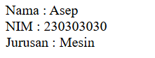
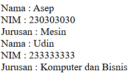
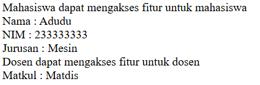
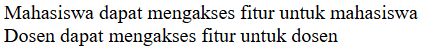
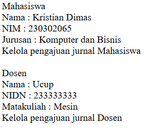

# PWEB2
### OOP (Object Oriented Programming)
*__OOP__* sendiri berisi sebuah data dan fungsi dibungkus ke dalam objek yang dibuat berdasarkan class.

<hr></hr>

### <p align= center>JOBSHEET 1</p>
#### <p align= center>Instruksi Kerja</p>
Penjelasan mengenai Instruksi Kerja pada pertemuan 1-2

<b><p>1. Membuat class </p></b>
Pada langkah pertama yaitu membuat class yang bernama Mahasiswa dengan atributnya yaitu nama, nim, dan jurusan yang bersifat public.

```php
class Mahasiswa {
    public $nama;
    public $nim;
    public $jurusan;

```

<b><p>2. Penggunaan construct </p></b>
penggunaan construct ini bertujuan untuk menginisialisasi onjek pada saat baru dibuat 
```php
// Construct
    public function __construct($nama, $nim, $jurusan){
        $this->nama = $nama;
        $this->nim = $nim;
        $this->jurusan = $jurusan;
    }
```

<b><p>3. Penggunaan Method</b></p>
method ini digunakan untuk nantinya menampilkan, mengubah, dan mengisikan sebuah data yang sudah diinstansiasi tadi

```php
// Construct
    public function __construct($nama, $nim, $jurusan){
        $this->nama = $nama;
        $this->nim = $nim;
        $this->jurusan = $jurusan;
    }
    
    // Fungsi tampilkanData
    public function tampilkanData(){
        echo "Saya $this->nama dengan NPM $this->nim dari jurusan $this->jurusan.<br>";
    }
    
    //  Method updateJurusan
    public function updateJurusan($newJurusan){
        $this->jurusan = $newJurusan;
    }

    //  Method setNim 
    public function setNim($newNim){ 
        $this->nim = $newNim;
    }
}
```

<b><p>4. Pembuatan Objek</b></p>
Langkah selanjutnya yaitu pembuatan objek / instansiasi dengan objeknya adalah mahasiswa1 yang dimana diinputkan value untuk Nim yaitu "230302011" dan mengubah nilai untuk jurusan yang sebelumnya "Komputer dan Bisnis" menjadi "Elektro"

```php
$mahasiswa1 = new Mahasiswa("Kristian Dimas Adi Wicaksono", "230302065", "Komputer dan Bisinis");
$mahasiswa1->tampilkanData();
$mahasiswa1->updateJurusan("Elektro");
$mahasiswa1->tampilkanData();
$mahasiswa1->setNim("230302011");
$mahasiswa1->tampilkanData();
```

#### <p align= center> Tugas 1</p>
Penjelasan mengenai tugas pada pertemuan 1-2


<b><p>1. Membuat class</b></p>
Pada langkah pertama yaitu membuat class yang bernama Dosen dengan isi atributnya yaitu nama, nip, dan matakuliah yang bersifat public
```ruby
class Dosen {
    public $nama;
    public $nip;
    public $mataKuliah;

```

<p><b>2. Penggunaan construct</b></p>
Digunakan untuk menginstansiasi sebuah atribut pada class dosen

```php
// Constructor
public function __construct($nama, $nip, $mataKuliah){
        $this->nama = $nama;
        $this->nip = $nip;
        $this->mataKuliah = $mataKuliah;
    }
```
<p><b>3. Penggunaan method</b></p>
method ini digunakan untuk nantinya menampilkan sebuah data yang sudah diinstansiasi tadi


```php
//  Method tampil Dosen
public function tampilkanDosen(){
        echo "Dosen : $this->nama<br> NIP : $this->nip<br> MataKuliah : $this->mataKuliah<br>";
    }
}
```
<b><p>4. Pembuatan objek</b></p>
Langkah selanjutnya yaitu pembuatan objek / instansiasi dengan objeknya adalah Dsn
```php
// Instansiasi Dosen
$Dsn = new Dosen("Kristian Dimas Adi Wicaksono", "22222222", "Bahasa");
$Dsn->tampilkanDosen();
```


### Hasil
Sehingga adapun hasil yang di dapat dalam Jobsheet 1 adalah sebagai berikut :


<hr>

### <p align="center">JOBSHEET 2</p>

#### 1. Membuat Class dan Object
<p align = "justify">Langkah pertama yaitu menentukan class dan objectnya, pada hal ini sudah ditetapkan bahwa akan membuat sebuah Class yang bernama Mahasiswa dengan atributnya yaitu nama, nim, dan jurusan.


Setelah itu membuat sebuah method untuk menampilkan sebuah data yang sudah diinstansiasikan.</p>

```php
<?php
// Definisi sebuah class
class Mahasiswa {
    // Atribut
    public $nama;
    public $nim;
    public $jurusan;

    // Constructor
    public function __construct($nama, $nim, $jurusan)
    {
        $this->nama = $nama;
        $this->nim = $nim;
        $this->jurusan = $jurusan;
    }

    // Method untuk menampilkan data mahasiswa
    public function tampilkanData(){
        echo "Nama : $this->nama <br> NIM : $this->nim <br> Jurusan : $this->jurusan";
    }
}

// Proses instansiasi object
$Mhs = new Mahasiswa (nama : "Asep", nim : "230303030", jurusan : "Mesin");
$Mhs->tampilkanData();
?>
```
Hasil :



#### 2. Encapsulation
<p align = "justify">Langkah ke-2 yaitu encapsulation dimana menyatukan atribut dan method yang biasa disebut dengan object. Encapsulation digunakan untuk membatasi akses terhadap atribut dan method, sehingga data yang diubah hanya data yang dipanggil melalui sebuah method tersebut. pada langkah ke-2 ini diterapkan dengan menggunakan method setter dan getter, contohnya setNama dan getNama dimana set untuk memberikan nilai kepada sebuah atribut dan get untuk mendapatkan data tersebut.</p>

```php
<?php
// Definisi sebuah class
class Mahasiswa {
    // Atribut
    private $nama;
    private $nim;
    private $jurusan;

    // Constructor
    public function __construct($nama, $nim, $jurusan)
    {
        $this->nama = $nama;
        $this->nim = $nim;
        $this->jurusan = $jurusan;
    }

    // Method untuk menampilkan data keseluruhan mahasiswa
    public function tampilkanData(){
        echo "Nama : $this->nama <br> NIM : $this->nim <br> Jurusan : $this->jurusan <br>";
    }
    // Method untuk meletakkan value nama 
    public function setNama($nama){
        $this->nama = $nama;
    }
    // Method untuk meletakkan value NIM
    public function setNim($nim){
        $this->nim = $nim;
    }
    // Method untuk meletakkan value Jurusan
    public function setJurusan($jurusan){
        $this->jurusan = $jurusan;
    }
    // Method untuk menampilkan data Nama mahasiswa
    public function getNama(){
        echo "Nama : $this->nama<br>";
    }
    // Method untuk menampilkan data NIM mahasiswa
    public function getNim(){
        echo "NIM : $this->nim<br>";
    }
    // Method untuk menampilkan data Jurusan mahasiswa
    public function getJurusan(){
        echo "Jurusan : $this->jurusan<br>";
    }
}

// Proses instansiasi object
$Mhs = new Mahasiswa (nama : "Asep", nim : "230303030", jurusan : "Mesin");
$Mhs->tampilkanData();
// Memberikan value Udin untuk atribut nama
$Mhs->setNama("Udin");
$Mhs->getNama();
// Memberikan value 233333333 untuk atribut NIM
$Mhs->setNim("233333333");
$Mhs->getNim();
 // Memberikan value Komputer dan Bisnis untuk atribut Jurusan
$Mhs->setJurusan("Komputer dan Bisnis");
$Mhs->getJurusan();
?>
```

Hasil : 



#### 3. Inheritance

<p align = "Justify">Inheritance yaitu pewarisan yang dimana terdapat sebuah class baru yang mewarisi class induk (superclass). Dengan adanya inheritance ini, kode program yang sama tidak perlu ditulis kembali ke dalam class lainnya seperti pada program dibawah ini, terdapat superclass pengguna dengan atribut nama dan terdapat subclass dosen dengan atribut mataKuliah. Selanjutnya melakukan proses instansiasi object dengan value untuk nama = "Adudu" dan value untuk MataKuliah = "Matdis".</p>

```php
<?php
// Definisi sebuah class
class Pengguna {
    // Atribut
    private $nama;
    
    // Constructor
    public function __construct($nama){
        $this->nama = $nama;
    }

    // Method untuk menampilkan nama pengguna
    public function getNama(){
        echo "Nama : $this->nama<br>";
    }
}

// Definisi sebuah class yang merupakan warisan dari pengguna
class Dosen extends Pengguna{
    private $mataKuliah;

    // Constructor
    public function __construct($nama, $mataKuliah){
        parent::__construct($nama);
        $this->mataKuliah = $mataKuliah;
    }

    // method untuk menampilkan mata kuliah
    public function getMataKuliah(){
        echo "Matkul : $this->mataKuliah<br>";
    }
}

// Memberikan value untuk nama dan matakuliah
$Dsn = new Dosen("Adudu", "Matdis");
// Menampilkan data pada class dosen
$Dsn->getMataKuliah();
?>
```

Hasil :


#### 4. Polymorphism

<p align="justify">Polymorphism dapat menggunakan method yang sama dengan superclass maupun subclass lainnya. Walaupun dapat menggunakan method yang sama, tetapi implementasinya harus berbeda. contohnya pada program dibawah ini yaitu pada class pengguna dengan potongan program 
<br> 

>public function aksesFitur
(){<br>
        echo "Pengguna dapat mengakses fitur untuk pengguna";<br>
    } </p>

dimana implementasi dari akses fitur tersebut berbeda dengan class yang lainnya.

```php
<?php
// Definisi sebuah class
class Pengguna {
    // Atribut
    private $nama;
    
    // Constructor
    public function __construct($nama){
        $this->nama = $nama;
    }

    // Method untuk menampilkan nama pengguna
    public function getNama(){
        echo "Nama : $this->nama<br>";
    }
    // Method untuk menampilkan akses fitur pengguna
    public function aksesFitur(){
        echo "Pengguna dapat mengakses fitur untuk pengguna";
    }
}

// Definisi sebuah class
class Mahasiswa extends pengguna {
    // Atribut
    private $nim;
    private $jurusan;

    // Constructor
    public function __construct($nama, $nim, $jurusan){
        parent::__construct($nama);
        $this->nim = $nim;
        $this->jurusan = $jurusan;
    }

    // Method untuk menampilkan data keseluruhan mahasiswa
    public function tampilkanData(){
        parent::getNama();
        echo "NIM : $this->nim <br> Jurusan : $this->jurusan <br>";
    }
    // Method untuk meletakkan value nama 
    public function setNama($nama){
        $this->nama = $nama;
    }
    // Method untuk meletakkan value NIM
    public function setNim($nim){
        $this->nim = $nim;
    }
    // Method untuk meletakkan value Jurusan
    public function setJurusan($jurusan){
        $this->jurusan = $jurusan;
    }
    // Method untuk menampilkan data Nama mahasiswa
    public function getNama(){
        echo "Nama : $this->nama<br>";
    }
    // Method untuk menampilkan data NIM mahasiswa
    public function getNim(){
        echo "NIM : $this->nim<br>";
    }
    // Method untuk menampilkan data Jurusan mahasiswa
    public function getJurusan(){
        echo "Jurusan : $this->jurusan<br>";
    }
    // Method untuk menampilkan akses fitur pada mahasiswa
    public function aksesFitur(){
        echo "Mahasiswa dapat mengakses fitur untuk mahasiswa<br>";
    }
}


// Definisi sebuah class yang merupakan warisan dari pengguna
class Dosen extends Pengguna{
    private $mataKuliah;

    // Constructor
    public function __construct($nama, $mataKuliah){
        parent::__construct($nama);
        $this->mataKuliah = $mataKuliah;
    }

    // method untuk menampilkan mata kuliah
    public function getMataKuliah(){
        echo "Matkul : $this->mataKuliah<br>";
    }

    // Method untuk menampilkan akses fitur pada mahasiswa
    public function aksesFitur(){
        echo "Dosen dapat mengakses fitur untuk dosen<br>";
    }
}

// Instansiasi objek
$Dsn = new Dosen("Adudu", "Matdis");
$Mhs = new Mahasiswa("Adudu","233333333","Mesin");
// Memanggil method akses fitur pada class Mahasiswa
$Mhs->aksesFitur();
// Memanggil method tampilkan data pada class Mahasiswa
$Mhs->tampilkanData();
// Memanggil method akses fitur pada class Dosen
$Dsn->aksesFitur();
// Memanggil method Mata Kuliah pada class Dosen
$Dsn->getMataKuliah();
?>
```
Hasil : 



#### 5. Abstraction

<p align="Justify">Abstraction berfungsi untuk menyembunyikan detail implementasi pada sebuah program. pada program dibawah ini abstraction ditulis sebagai "abstract public function aksesFitur();" yang berfungsi agar kelas turunannya wajib mengimplementasikan aksesFitur tersebut. </p>

```php
<?php
// Definisi sebuah class
abstract class Pengguna {
    // Atribut
    private $nama;
    
    // Constructor
    public function __construct($nama){
        $this->nama = $nama;
    }

    // abstract method
    abstract public function aksesFitur();
}


// Definisi sebuah class
class Mahasiswa extends pengguna {
    // Atribut
    private $nim;
    private $jurusan;

    // Constructor
    public function __construct($nama, $nim, $jurusan){
        parent::__construct($nama);
        $this->nim = $nim;
        $this->jurusan = $jurusan;
    }

    // Method untuk menampilkan data keseluruhan mahasiswa
    public function tampilkanData(){
        parent::getNama();
        echo "NIM : $this->nim <br> Jurusan : $this->jurusan <br>";
    }
    // Method untuk meletakkan value nama 
    public function setNama($nama){
        $this->nama = $nama;
    }
    // Method untuk meletakkan value NIM
    public function setNim($nim){
        $this->nim = $nim;
    }
    // Method untuk meletakkan value Jurusan
    public function setJurusan($jurusan){
        $this->jurusan = $jurusan;
    }
    // Method untuk menampilkan data Nama mahasiswa
    public function getNama(){
        echo "Nama : $this->nama<br>";
    }
    // Method untuk menampilkan data NIM mahasiswa
    public function getNim(){
        echo "NIM : $this->nim<br>";
    }
    // Method untuk menampilkan data Jurusan mahasiswa
    public function getJurusan(){
        echo "Jurusan : $this->jurusan<br>";
    }
    // Method untuk menampilkan akses fitur pada mahasiswa
    public function aksesFitur(){
        echo "Mahasiswa dapat mengakses fitur untuk mahasiswa<br>";
    }
}


// Definisi sebuah class yang merupakan warisan dari pengguna
class Dosen extends Pengguna{
    private $mataKuliah;

    // Constructor
    public function __construct($nama, $mataKuliah){
        parent::__construct($nama);
        $this->mataKuliah = $mataKuliah;
    }

    // method untuk menampilkan mata kuliah
    public function getMataKuliah(){
        echo "Matkul : $this->mataKuliah<br>";
    }

    // Method untuk menampilkan akses fitur pada mahasiswa
    public function aksesFitur(){
        echo "Dosen dapat mengakses fitur untuk dosen<br>";
    }
}

// Instansiasi objek
$Dsn = new Dosen("Adudu", "Matdis");
$Mhs = new Mahasiswa("Adudu","233333333","Mesin");
// Memanggil method akses fitur pada class Mahasiswa
$Mhs->aksesFitur();
// Memanggil method akses fitur pada class Dosen
$Dsn->aksesFitur();
?>
```

Hasil : 




### <p align="center"> JOBSHEET 3 </p>

#### <p align="center"> Instruksi Kerja </p>

#### 1. Inheritance

kode dibawah ini menggunakan inheritance agar class student mewariskan atribut dan method yang ada di kelas abstract person. Pada class student juga menambahkan attribut khusus yaitu studentID, class student dapat menggunakan dan memperluas fungsi yang ada pada class person seperti setName()
```php
<?php
// Kelas abstract Person
abstract class Person{
    // Attribute protected
    protected $name;

    // Constructor
    public function __construct($name){
        $this->name = $name;
    }

    // Method setter untuk atribute name
    public function setName($name){
        $this->name = $name;    
    }

    // Method abstract getter 
    abstract public function getName();
}

// Kelas students extends person
class Student extends Person{
    private $studentID;

    // constructor untuk menginisialisasi nama dan student id
    public function __construct($name, $studentID){
        parent::__construct($name);
        $this->studentID = $studentID;
    }

    // setter untuk mengubah nilai student
    public function setStudentID($studentID){
        $this->studentID = $studentID;
    }

    // getter untuk mendapatkan student id
    public function getStudentID(){
        echo "ID : $this->studentID";
    }

    // getter untuk mendapatkan nama
    public function getName(){
        echo "Nama Pelajar : $this->name<br>";
    }
}
```

#### 2. Polymorphism

Polymorphism pada potongan program dibawah ini terdapat pada method getName() yang diimplementasikan pada kelas student dan teacher.Pada class student berisi Nama Pelajar, dan pada class teacher berisi Nama Murid. getName yang berbeda penempatan berfungsi untuk memanggil metode yang sama dengan hasil sesuai dengan penempatannya.

```php
class Student extends Person{
    private $studentID;

    // constructor untuk menginisialisasi nama dan student id
    public function __construct($name, $studentID){
        parent::__construct($name);
        $this->studentID = $studentID;
    }

    // setter untuk mengubah nilai student
    public function setStudentID($studentID){
        $this->studentID = $studentID;
    }

    // getter untuk mendapatkan student id
    public function getStudentID(){
        echo "ID : $this->studentID";
    }

    // getter untuk mendapatkan nama
    public function getName(){
        echo "Nama Pelajar : $this->name<br>";
    }
}

// Kelas teacher extends person
class Teacher extends Person{
    public $TeacherID;

    // Constructor untuk menginisialisasi nama dan teacher id
    public function __construct($name, $TeacherID){
        parent::__construct($name);
        $this->TeacherID = $TeacherID;
    }

    // getter untuk mendapatkan nama
    public function getName(){
        echo "Nama Murid : $this->name<br>";
    }
}
```

#### 3. Encapsulation

Encapsulation pada program dibawah ini terletak pada penggunaan akses private untuk studentID yang dimana attribute ini hanya dapat diakses melalui setStudentID dan getStudentID.

```php
class Student extends Person{
    private $studentID;

    // constructor untuk menginisialisasi nama dan student id
    public function __construct($name, $studentID){
        parent::__construct($name);
        $this->studentID = $studentID;
    }

    // setter untuk mengubah nilai student
    public function setStudentID($studentID){
        $this->studentID = $studentID;
    }

    // getter untuk mendapatkan student id
    public function getStudentID(){
        echo "ID : $this->studentID";
    }

    // getter untuk mendapatkan nama
    public function getName(){
        echo "Nama Pelajar : $this->name<br>";
    }
}
```

#### 4. Abstraction
Abstraction pada program berikut terlihat pada class course diman getCourseDetails(). Untuk dapat menggunakan getCourseDetails(), ini dapat dilakukan dengan menggunakan subclass dari superclass tersebut.
```php
// Kelas abstract course
abstract class Course{

    // abstract method untuk course details
    abstract public function getCourseDetails();
}

// Kelas extends(turunan) Course
class OnlineCourse extends Course{

    // Method mencetak detail course
    public function getCourseDetails(){
        echo "Online Course<br>";
    }
}

class OfflineCourse extends Course{
    // Method mencetak detail course
    public function getCourseDetails(){
        echo "Offline Course<br>";
    }
}
```

Program keseluruhan : 

```php
<?php
// Kelas abstract Person
abstract class Person{
    // Attribute protected
    protected $name;

    // Constructor
    public function __construct($name){
        $this->name = $name;
    }

    // Method setter untuk atribute name
    public function setName($name){
        $this->name = $name;    
    }

    // Method abstract getter 
    abstract public function getName();
}

// Kelas students extends person
class Student extends Person{
    private $studentID;

    // constructor untuk menginisialisasi nama dan student id
    public function __construct($name, $studentID){
        parent::__construct($name);
        $this->studentID = $studentID;
    }

    // setter untuk mengubah nilai student
    public function setStudentID($studentID){
        $this->studentID = $studentID;
    }

    // getter untuk mendapatkan student id
    public function getStudentID(){
        echo "ID : $this->studentID";
    }

    // getter untuk mendapatkan nama
    public function getName(){
        echo "Nama Pelajar : $this->name<br>";
    }
}

// Kelas teacher extends person
class Teacher extends Person{
    public $TeacherID;

    // Constructor untuk menginisialisasi nama dan teacher id
    public function __construct($name, $TeacherID){
        parent::__construct($name);
        $this->TeacherID = $TeacherID;
    }

    // getter untuk mendapatkan nama
    public function getName(){
        echo "Nama Murid : $this->name<br>";
    }
}

// Kelas abstract course
abstract class Course{

    // abstract method untuk course details
    abstract public function getCourseDetails();
}

// Kelas extends(turunan) Course
class OnlineCourse extends Course{

    // Method mencetak detail course
    public function getCourseDetails(){
        echo "Online Course<br>";
    }
}

class OfflineCourse extends Course{
    // Method mencetak detail course
    public function getCourseDetails(){
        echo "Offline Course<br>";
    }
}

// Instansiasi objek
$murid = new Student("Dimas", "12");
$guru = new Teacher("Josh", "16");

// Memanggil method getname dari class student
$murid->getName();
// Memanggil method getname dari class teacher
$guru->getName();
// Mengubah nama murid di class student
$murid->setName("Nale");
// Memanggil method getname untuk menampilkan nama baru
$murid->getName();

// instansiasi objek
$Online = new OnlineCourse();
// Memanggil method untuk menampilkan detail course
$Online->getCourseDetails();
// instansiasi objek
$Offline = new OfflineCourse();
// Memanggil method untuk menampilkan detail course
$Offline->getCourseDetails();
?>
```

Hasil :


#### <p align="center"> Tugas </p>

#### Penjelasan Program
    
<b>Abstract</b> :
Program diatas merupakan implementasi menggunaakan OOP, dimana terdapat 2 kelas abstract yang bernama Person2 dan jurnal, kedua class tersebut mendefinisikan sebuah method yang kemudian diimplementasikan oleh kelas turunannya masing masing dimana Kelas turunan yang ada pada class Person2 yaitu Mahasiswa dan Dosen, Kelas turunan yang ada pada class Jurnal yaitu JurnalMahasiswa dan JurnalDosen.
    
<b>Encapsulation</b> : 
Adapun beberapa attribute yang terdapat pada abstract class Person2 seperti name yang bersifat protected, dan pada class turunannya yaitu class Mahasiswa terdapat 2 attribute yang berisi nim dan jurusan yang bersifat private, dan pada class turunan yang lainnya yaitu class mahasiswa berisi 2 attribute diantaranya adalah nim dan jurusan.
    
<b>Inheritance</b> :
Kedua abstract class tersebut mewariskan sifatnya yang menggunakan kembali sebuah kode pada class anaknya. seperti pada class Mahasiswa dan Dosen yang mewariskan class Person2. Selain itu ada juga class JurnalMahasiswa dan JurnalDosen yang mewariskan class Jurnal.
    
<b>Polymorphism</b> :
Method getRole() memang memiliki nama yang sama tetapi jika sudah diimplementasikan kepada class yang berbeda, isi dari getRole() sendiri memiliki hasil yang berbeda. contohnya pada class Mahasiswa dan Dosen. Selain getRole() ada juga method jurnal() yang terletak pada class JurnalMahasiswa dan JurnalDosen, keduanya ini memiliki isi yang berbeda sesuai dengan classnya masing masing.

Program :

```php
<?php
// Kelas abstract Person
abstract Class Person2{
    // Attribute protected
    protected $name;

    // Constructor inisialisasi attribute
    public function __construct($name){
        $this->name = $name;
    }

    // setter mengubah nilai name
    public function setName($name){
        $this->name = $name;
    }

    // getter untuk mendapatkan
    public function getName(){
        echo "Nama : $this->name<br>";
    }

    // getter untuk Role
    abstract public function getRole();
}

// class extends dari class person2
class Mahasiswa extends Person2{
    // Attribute private
    private $nim;
    private $jurusan;

    // Constructor inisialisasi attribute
    public function __construct ($name, $nim, $jurusan){
        parent::__construct($name);
        $this->nim = $nim;
        $this->jurusan = $jurusan;
    }

    // setter untuk mengubah nilai Nim
    public function setNim($nim){
        $this->nim = $nim;
    }

    // setter untuk mengubah nilai Jurusan
    public function setJurusan($jurusan){
        $this->jurusan = $jurusan;
    }

    // getter untuk mendapatkan nilai name, nim, dan jurusan
    public function getData(){
        parent::getName();
        echo "NIM : $this->nim <br> Jurusan : $this->jurusan <br>";
    }
    
    // getter untuk mendapatkan role
    public function getRole(){
        echo "Mahasiswa<br>";
    }
}

// class extends dari person2
class Dosen extends Person2{
    // Attribute Private
    private $Nidn;
    private $Matakuliah;

    // constructor untuk menginisialisasi attribute
    public function __construct($name, $Nidn, $Matakuliah){
        parent::__construct($name);
        $this->Nidn = $Nidn;
        $this->Matakuliah = $Matakuliah;
    }

    // setter untuk mengubah nilai Nidn
    public function setNidn($nidn){
        $this->Nidn = $nidn;
    }

    // setter untuk mengubah nilai matakuliah
    public function setMatakuliah($Matakuliah){
        $this->Matakuliah = $Matakuliah;
    }

    // getter untuk mendapatkan nilai name, nidn, dan matakuliah
    public function getData(){
        parent::getName();
        echo "NIDN : $this->Nidn <br> Matakuliah : $this->Matakuliah<br>";
    }

    // getter untuk mendapatkan role
    public function getrole(){
        echo "Dosen<br>";
    }
}

// Kelas abstract jurnal
abstract class jurnal{
    // method untuk jurnal
    abstract public function jurnal();
}

// class extends dari class jurnal
class JurnalMahasiswa extends jurnal{
    // method jurnal
    public function jurnal(){
    echo "Kelola pengajuan jurnal Mahasiswa<br><br>";
    }
}

// class extends dari class jurnal
class JurnalDosen extends jurnal{

    // method jurnal
    public function jurnal(){
    echo "Kelola pengajuan jurnal Dosen";
    }
}

// Instansiasi objek
$Mahasiswa = new Mahasiswa("Kristian Dimas","230302065","Komputer dan Bisnis");
// Memanggil method getRole
$Mahasiswa->getRole();
// Memanggil method getData
$Mahasiswa->getData();
// Instanisasi jurnal
$JurnalMhs = new JurnalMahasiswa();
// Memanggil method jurnal
$JurnalMhs->jurnal();
// Instanisasi objek
$Dosen = new Dosen("Ucup","233333333","Mesin");
// Memanggil method getrole
$Dosen->getRole();
// Memanggil method getData
$Dosen->getData();
// Instansiasi objek
$JurnalDsn = new JurnalDosen();
// Memanggil method jurnal
$JurnalDsn->jurnal();
?>
```


#### Hasil

